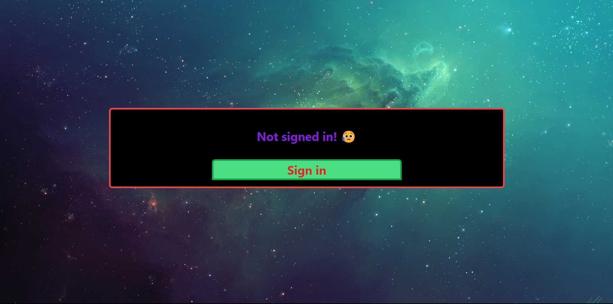
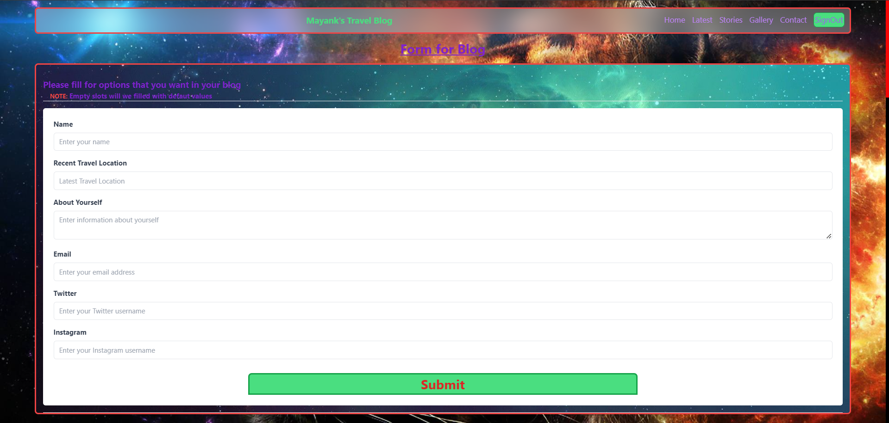
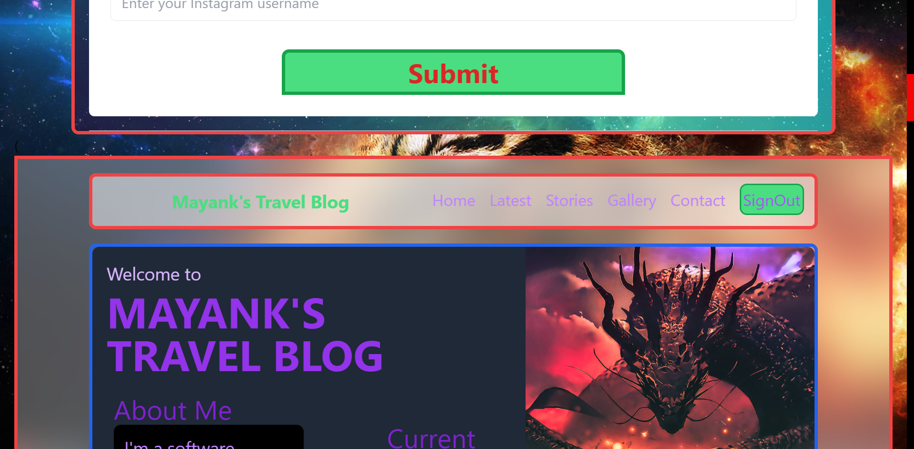
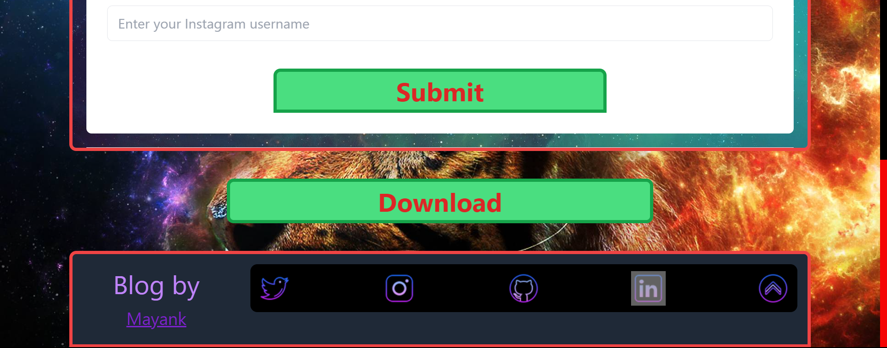

# onHandBlogs

- Create Your travel blogs with jsut simple form filling, ready to deploy template and no need to worry about the backend.
- No typical routes and no typing of long codes, just simple form and API calls
- Totally made in consideration of non-tech personals who especially likes traveling and sharing thier information with others.
- You will get txt file in otput with all code written on it just copy and paste it in your code editor and you are ready to go.
- Complete blog in just 5 minutes and few clicks here and there and ready to go.
- Realtime review your blog as _realtime review display_ is inbuilt.
- make changes and see it on display directly.
  > You have to login with github(\*for now only) to make the blog and you will get the link of your blog in the output.

## How to get it locally

```bash
# clone the repo
git clone https://github.com/mstomar698/onHandBlogs.git
# change the working directory to onHandBlogs
cd onHandBlogs
# install the requirements
npm install
# start the development server
npm run dev
# build for production and launch server
npm run build
```

## See Live Preview [here](https://onhandblogs.vercel.app/)

> ### Don't forget to leave a star ⭐

## Contributing

```bash
# Just fork the repo and make changes and make a pull request
> ### 👍 Thanks for contributing in advance
```

## Pictorial Demo






> Note: This project is still in development phase and will be updated soon with more features and bug fixes.

#### Made with ❤️ by [mstomar698](http://mstomar.me)
